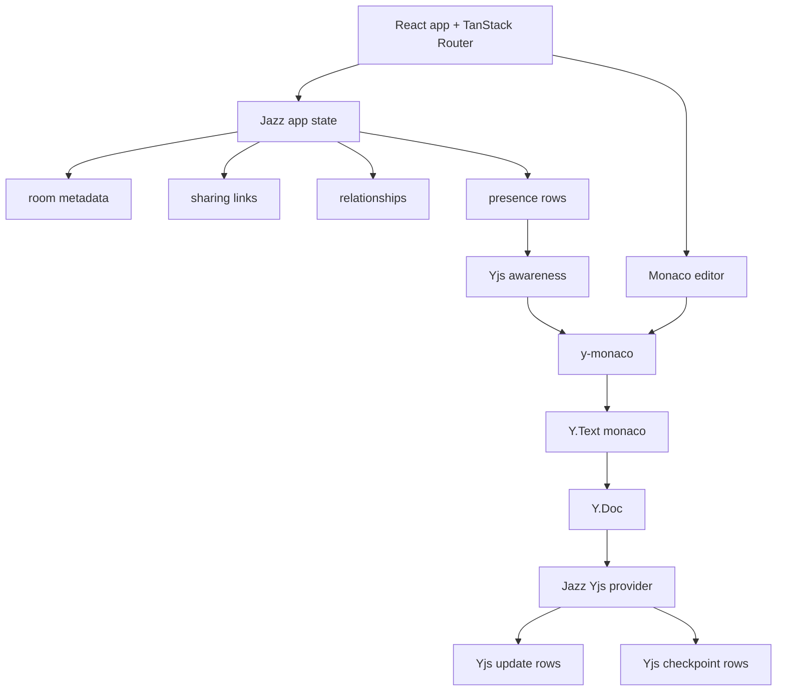

## Why the architecture is split

The editor state is split because each state type has different requirements.

Yjs text updates need CRDT semantics. They must support concurrent edits, offline work, duplicate delivery, and convergence.

Room metadata does not need text CRDT behavior. Fields like title, language, deletion state, and share identifiers should stay as Jazz data so they are easy to query and authorize.

Presence should not be part of document history. Cursor position, selection, display name, color, and active state are session state. They should be mutable and disposable.

Jazz stores and syncs these pieces, but each piece keeps its own model:

- Yjs updates: append-only Jazz rows.
- Yjs checkpoints: Jazz rows for materialization and compaction.
- Room metadata: Jazz objects.
- Sharing links and relationships: Jazz objects.
- Presence: mutable Jazz rows bridged into Yjs awareness.

## Technology stack

- pnpm workspace for package management.
- Vite for the web build.
- React for the UI.
- TanStack Router for routing and route loaders.
- Jazz for auth, sync, permissions, and local-first data persistence.
- Hono for HTTP routes that need a server boundary.
- shadcn/ui, base/ui, and tailwind/css for UI primitives and styling.
- Monaco for code editing.
- Yjs for collaborative text state.
- `y-monaco` for Monaco/Yjs binding and cursor decorations.

## System architecture

